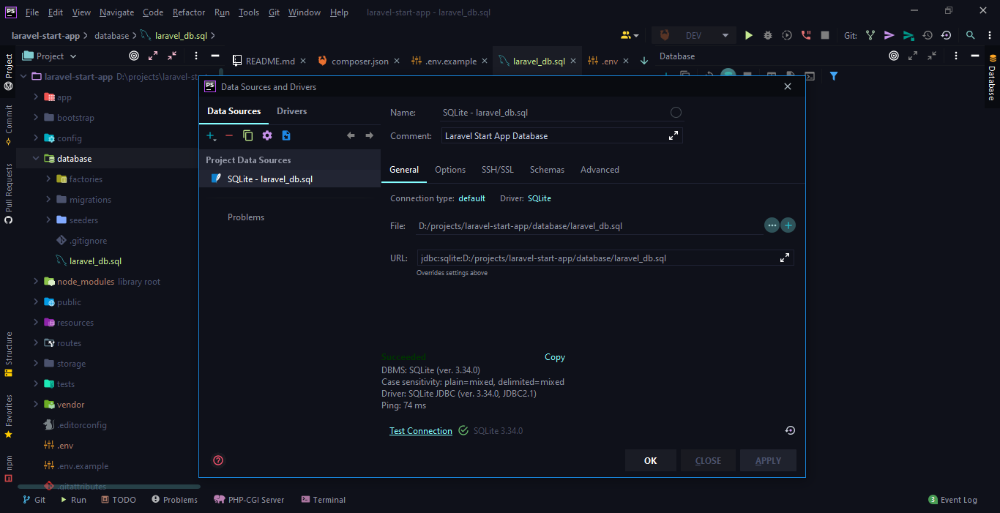

# Laravel Start App

### Laravel v8.45.1 (PHP v7.4.13)

---

## Routes:

- [http://127.0.0.1:8000/welcome](http://127.0.0.1:8000/welcome)
- [http://127.0.0.1:8000/home](http://127.0.0.1:8000/home)
- [http://127.0.0.1:8000/new_controller?adult=18](http://127.0.0.1:8000/new_controller?adult=18)
- [http://127.0.0.1:8000/register](http://127.0.0.1:8000/register)
- [http://127.0.0.1:8000/login](http://127.0.0.1:8000/login)
- [http://127.0.0.1:8000/forgot-password](http://127.0.0.1:8000/forgot-password)
- [localhost:8000/dashboard](http://localhost:8000/dashboard)

---

1) ## Run in terminal

```
npm i
composer i
```

2) ## Starting [MSQL Server](https://dev.mysql.com/downloads/file/?id=505212):

- `mysql -u root -p` ... Enter password: *****
- edit [.env](.env) file:

``` 
APP_NAME=Laravel
APP_ENV=local
APP_KEY=base64:vJ+k/Zx9sqsbLEPoMfN1VkgR55etRP5Yw1tyuiGxEek=
APP_DEBUG=true
APP_URL=http://localhost

LOG_CHANNEL=stack
LOG_LEVEL=debug

DB_CONNECTION=mysql
DB_HOST=127.0.0.1
DB_PORT=3306
DB_DATABASE=sampledb
DB_USERNAME=root
DB_PASSWORD=admin

BROADCAST_DRIVER=log
CACHE_DRIVER=file
FILESYSTEM_DRIVER=local
QUEUE_CONNECTION=sync
SESSION_DRIVER=database
SESSION_LIFETIME=120

MEMCACHED_HOST=127.0.0.1

REDIS_HOST=127.0.0.1
REDIS_PASSWORD=null
REDIS_PORT=6379

MAIL_MAILER=smtp
MAIL_HOST=mailhog
MAIL_PORT=1025
MAIL_USERNAME=null
MAIL_PASSWORD=null
MAIL_ENCRYPTION=null
MAIL_FROM_ADDRESS=null
MAIL_FROM_NAME="${APP_NAME}"

AWS_ACCESS_KEY_ID=
AWS_SECRET_ACCESS_KEY=
AWS_DEFAULT_REGION=us-east-1
AWS_BUCKET=
AWS_USE_PATH_STYLE_ENDPOINT=false

PUSHER_APP_ID=
PUSHER_APP_KEY=
PUSHER_APP_SECRET=
PUSHER_APP_CLUSTER=mt1

MIX_PUSHER_APP_KEY="${PUSHER_APP_KEY}"
MIX_PUSHER_APP_CLUSTER="${PUSHER_APP_CLUSTER}"
```

3) ## Run in terminal:

``` 
php artisan config:clear && php artisan config:cache && php artisan serve
```

4) ## Starting Laravel development server:

[http://127.0.0.1:8000](http://127.0.0.1:8000)

5) ## Create `sampledb` & Make migrations (if database is not exist):

```
mysql -u root -p
SET GLOBAL time_zone = '+3:00';

mysql
CREATE DATABASE sampledb;
quit

php artisan migrate
php artisan route:clear && php artisan key:generate && php artisan serve

```

----

6) ## Create `sampledb` dump (`mysql -u root -p && CREATE DATABASE sampledb; quit && php artisan migrate`):
    - connect to Database: Menu => View => Tool Windows => Database => + => Data Source => MySQL => ... => Test => OK
    - right click on database connection => **Export with mysqldump** =>
      path: `C:/Program Files/MySQL/MySQL Workbench 8.0/mysqldump.exe`
      => ` --result-file="D:\\projects\\!db-dump\\dump-sampleDB-01.sql"  --databases sampledb `
    - right click on database connection => **Restore with mysql** =>
      path: `C:/Program Files/MySQL/MySQL Workbench 8.0/mysql.exe`
      => `--database="sampledb" < "D:\\projects\\!db-dump\\dump-sampleDB-01.sql" `
    - refresh BD (Database tab) && right click => Database Tools => **Manage Shown Schemas ...**
    - [msqldump docs](https://dev.mysql.com/doc/refman/8.0/en/mysqldump.html)
    - [msql docs](https://dev.mysql.com/doc/refman/8.0/en/mysql-batch-commands.html)

``` 
mysqldump -u user -p database > backup.sql
mysql -u user -p database < backup.sql
```

7) ## Other options to fix possible issues:

```
composer run-script post-autoload-dump
composer run-script post-root-package-install
composer run-script post-create-project-cmd
```

```
php artisan serve --port=8080

php artisan config:clear
php artisan config:cache
php artisan optimize
php artisan cache:clear
php artisan route:cache
php artisan view:clear
```

8) ## Check Errors

View [log file](storage/logs/laravel.log)

9) ## Configure [php.ini](php.ini)

``` 
php --ini

; On windows:
extension_dir = "ext"

extension=curl
extension=fileinfo
extension=gd2
extension=mbstring
extension=mysqli
extension=openssl
extension=pdo_mysql
extension=odbc
extension=pdo_odbc
extension=pgsql
extension=pdo_pgsql
extension=pdo_sqlite

mysqli.default_port = 3306
mysqli.default_user =
mysqli.default_pw =

openssl.cafile=C:\Program Files\PHP\v7.4\ext\php_openssl.dll

memory_limit = 128M
```

10) ## Laravel 8 Requirements:

1. PHP 7.4
2. Composer
3. Node.js 16
4. MSQL Server, Apache Server (XAMPP) or alternatives
5. Laravel8 provides first-party support for four [databases](https://laravel.com/docs/8.x/database):
    - MySQL 5.7+
    - PostgreSQL 9.6+
    - SQLite 3.8.8+
    - SQL Server
      2017+ ([SQL Server 2019 Express Edition](https://download.microsoft.com/download/7/f/8/7f8a9c43-8c8a-4f7c-9f92-83c18d96b681/SQL2019-SSEI-Expr.exe)
        - php migration issues!)

---

11) ## Composer

1. install Composer - download & run installer

2. check composer version:

```
composer -V

Composer version 2.1.1 2021-06-04 08:46:46
```

3. init project

```
composer init
```

12) ## Laravel

1. install Laravel - Installation Via Composer

```
composer create-project laravel/laravel laravel-start-app
```

2. edit [php.ini](php.ini) uncomment line => `;extension_dir = "ext"`, `;extension=fileinfo`, `;extension=openssl`

```
php --ini
extension_dir = "ext"
extension=fileinfo
extension=openssl
openssl.cafile=ext/php_openssl.dll
openssl.cafile=C:\Program Files\PHP\v7.4\ext\php_openssl.dll
```

13) ## Deployment

- [Deploy to Hosting](https://www.ukraine.com.ua/wiki/hosting/frameworks/laravel/transfer-to-hosting/)
  using [SSH](https://www.ukraine.com.ua/wiki/hosting/ssh/connect/)

- [Video tutorial](https://youtu.be/h6CjHhZPQBI)

- [Documentation](https://laravel.com/docs/8.x/deployment)

- [Free Domains](https://www.freenom.com/)

---

14) ## Links:

- [Node.js® is a JavaScript runtime built on Chrome's V8 JavaScript engine.](https://nodejs.org/)
- [Composer 2.0 - A Dependency Manager for PHP](https://getcomposer.org)
- [Download Composer](https://getcomposer.org/download/)
- [Download and run Composer-Setup.exe](https://getcomposer.org/Composer-Setup.exe)
- [Laravel The Full Stack Framework](https://laravel.com)
- [Laravel Installation](https://laravel.com/docs/8.x/installation)
- [PHP Install](https://www.php.net/manual/ru/install.php)
- [XAMPP](https://www.apachefriends.org/ru/index.html)
- [Web Platform Installer](https://www.microsoft.com/web/downloads/platform.aspx):
    - PHP 8
    - MS Drivers 5.9 for PHP 8 for SQL Server
- [Blade Templates Syntax Documentation](https://laravel.com/docs/8.x/blade)
- [prettier/plugin-php](https://github.com/prettier/plugin-php)
- [Authentication](https://laravel.com/docs/8.x/authentication)
- [Authentication](https://laravel.su/docs/6.x/authentication)
- [Jetstream](https://jetstream.laravel.com/2.x/installation.html) => `composer require laravel/jetstream`
  => `php artisan jetstream:install inertia`
- [Jetstream is designed using Tailwind CSS and offers your choice of Livewire or Inertia scaffolding](https://jetstream.laravel.com/2.x/introduction.html)
- [How to create a new database in Microsoft SQL Server](https://support.mailessentials.gfi.com/hc/en-us/articles/360015116400-How-to-create-a-new-database-in-Microsoft-SQL-Server)
- [MS SQL Server - Create Database](https://www.tutorialspoint.com/ms_sql_server/ms_sql_server_create_database.htm)
- [Create a Database](https://docs.microsoft.com/en-us/sql/relational-databases/databases/create-a-database?view=sql-server-ver15)
- [Техническая документация по SQL Server](https://docs.microsoft.com/ru-ru/sql/sql-server/?view=sql-server-ver15)
- [SQL Tutorial](https://www.w3schools.com/sql/default.asp)
- [Export and import data in PhpStorm](https://www.jetbrains.com/help/phpstorm/exporting-and-importing-data.html)
- [Import data in PhpStorm](https://www.jetbrains.com/help/phpstorm/import-data.html)
  
  
- [phpMyAdmin 5.1.1](https://www.phpmyadmin.net/downloads/) ~ Current version compatible with PHP 7.1 and newer and
  MySQL/MariaDB 5.5 and newer.
- [phpMyAdmin Установка на Windows](https://docs.phpmyadmin.net/uk/latest/setup.html#installing-on-windows)
- [Getting started with phpmyadmin](https://riptutorial.com/phpmyadmin)
- [TablePlus](https://tableplus.com/download)
- [DataGrip](https://www.jetbrains.com/ru-ru/datagrip/)
- [DATAGRIP QUICK START GUIDE](https://www.jetbrains.com/datagrip/quick-start/)
- [Connecting DataGrip to MS SQL Server](https://blog.jetbrains.com/datagrip/2016/06/21/connecting-datagrip-to-ms-sql-server/)
- [DataGrip Database connection](https://www.jetbrains.com/help/datagrip/connecting-to-a-database.html)
- [DataGrip Импорт и экспорт параметров](https://www.jetbrains.com/ru-ru/datagrip/features/importexport.html)
- [mysqldump — A Database Backup Program](https://dev.mysql.com/doc/refman/5.7/en/mysqldump.html)
- [pg_dump](https://www.postgresql.org/docs/9.5/app-pgdump.html)
- [SQL Server Express does not enable TCP support by default](https://www.papercut.com/support/resources/manuals/ng-mf/common/topics/ext-db-specific-ms-sql-express.html)
- [Extension=php_sqlsrv.dll](https://docs.microsoft.com/en-us/sql/connect/php/download-drivers-php-sql-server?view=sql-server-ver15)
- [Docker db migrate](https://www.digitalocean.com/community/tutorials/how-to-use-database-migrations-and-seeders-to-abstract-database-setup-in-laravel-ru)
- [SQL List All Tables](https://www.sqltutorial.org/sql-list-all-tables/)
- [Examples: Azure Synapse Analytics and Parallel Data Warehouse](https://docs.microsoft.com/en-us/sql/t-sql/functions/db-name-transact-sql?redirectedfrom=MSDN&view=sql-server-ver15)
- [Tutorial: Build a PHP and MySQL app in Azure App Service](https://docs.microsoft.com/en-us/azure/app-service/tutorial-php-mysql-app?pivots=platform-windows)
- [ MySQL Community Downloads](https://dev.mysql.com/downloads/file/?id=505212)
- [mysql-installer-web-community-8.0.25.0.msi](https://cdn.mysql.com//Downloads/MySQLInstaller/mysql-installer-web-community-8.0.25.0.msi)

---

15) ## ERRORS

Run in terminal:

```
php --ini
```

> ### Problem 1
>
> - laravel/framework[v8.40.0, ..., 8.x-dev] require league/flysystem ^1.1 -> satisfiable by league/flysystem[1.1.0, ..., 1.x-dev].
> - league/flysystem[1.1.0, ..., 1.x-dev] require ext-fileinfo \* -> it is missing from your system. Install or enable PHP's fileinfo extension.
> - Root composer.json requires laravel/framework ^8.40 -> satisfiable by laravel/framework[v8.40.0, ..., 8.x-dev].
>
> You need to uncomment this line in the php.ini file located in your PHP installation folder:
>
> ;extension=fileinfo
> Remove the semicolon and save the file.
>
> extension=fileinfo
>
> ### Problem 2
>
> [Composer\Exception\NoSslException]  
> The openssl extension is required for SSL/TLS protection but is not available. If you can not enable the openssl extension, you can disable this error, at your own risk, by setting t  
> he 'disable-tls' option to true.
>
> his issue occurs due to openssl and extension director so uncomment below extensions in php.ini file
>
> extension=php_openssl.dll
>
> ### Directory in which the loadable extensions (modules) reside.
>
> ; http://php.net/extension-dir
> extension_dir = "./"
> ; On windows:
> extension_dir = "ext"

---

<p align="center"><a href="https://laravel.com" target="_blank"></a></p>

<p align="center">
<a href="https://travis-ci.org/laravel/framework"></a>
<a href="https://packagist.org/packages/laravel/framework"></a>
<a href="https://packagist.org/packages/laravel/framework"></a>
<a href="https://packagist.org/packages/laravel/framework"></a>
</p>

16) ## About Laravel

Laravel is a web application framework with expressive, elegant syntax. We believe development must be an enjoyable and
creative experience to be truly fulfilling. Laravel takes the pain out of development by easing common tasks used in
many web projects, such as:

- [Simple, fast routing engine](https://laravel.com/docs/routing).
- [Powerful dependency injection container](https://laravel.com/docs/container).
- Multiple back-ends for [session](https://laravel.com/docs/session) and [cache](https://laravel.com/docs/cache)
  storage.
- Expressive, intuitive [database ORM](https://laravel.com/docs/eloquent).
- Database agnostic [schema migrations](https://laravel.com/docs/migrations).
- [Robust background job processing](https://laravel.com/docs/queues).
- [Real-time event broadcasting](https://laravel.com/docs/broadcasting).

Laravel is accessible, powerful, and provides tools required for large, robust applications.

## Learning Laravel

Laravel has the most extensive and thorough [documentation](https://laravel.com/docs) and video tutorial library of all
modern web application frameworks, making it a breeze to get started with the framework.

If you don't feel like reading, [Laracasts](https://laracasts.com) can help. Laracasts contains over 1500 video
tutorials on a range of topics including Laravel, modern PHP, unit testing, and JavaScript. Boost your skills by digging
into our comprehensive video library.

## Laravel Sponsors

We would like to extend our thanks to the following sponsors for funding Laravel development. If you are interested in
becoming a sponsor, please visit the Laravel [Patreon page](https://patreon.com/taylorotwell).

### Premium Partners

- **[Vehikl](https://vehikl.com/)**
- **[Tighten Co.](https://tighten.co)**
- **[Kirschbaum Development Group](https://kirschbaumdevelopment.com)**
- **[64 Robots](https://64robots.com)**
- **[Cubet Techno Labs](https://cubettech.com)**
- **[Cyber-Duck](https://cyber-duck.co.uk)**
- **[Many](https://www.many.co.uk)**
- **[Webdock, Fast VPS Hosting](https://www.webdock.io/en)**
- **[DevSquad](https://devsquad.com)**
- **[Curotec](https://www.curotec.com/services/technologies/laravel/)**
- **[OP.GG](https://op.gg)**

## Contributing

Thank you for considering contributing to the Laravel framework! The contribution guide can be found in
the [Laravel documentation](https://laravel.com/docs/contributions).

## Code of Conduct

In order to ensure that the Laravel community is welcoming to all, please review and abide by
the [Code of Conduct](https://laravel.com/docs/contributions#code-of-conduct).

## Security Vulnerabilities

If you discover a security vulnerability within Laravel, please send an e-mail to Taylor Otwell
via [taylor@laravel.com](mailto:taylor@laravel.com). All security vulnerabilities will be promptly addressed.

## License

The Laravel framework is open-sourced software licensed under the [MIT license](https://opensource.org/licenses/MIT).

---

## ++++++++++++++++++++++++++++++++++++++++++++++++++++++++++++++

17) # Code writing hints:

## Create new [Controller](https://laravel.com/docs/8.x/controllers#dependency-injection-and-controllers) => run in terminal:

```
php artisan make:controller NewController
```

Result: app => Http => Controllers => [NewController.php](app/Http/Controllers/NewController.php)

## Create new url route:

routes => [web.php](routes/web.php) => add:

```
use App\Http\Controllers\NewController;

Route::get('/new_controller', [NewController::class, 'index']);
```

Result: [http://127.0.0.1:8000/new_controller](http://127.0.0.1:8000/new_controller)

## Create new view:

resources => views => [new_controller_view.blade.php](resources/views/new_controller_view.blade.php) => add:

```
<!DOCTYPE html>
<html lang="{{ str_replace('_', '-', app()->getLocale()) }}">
<head>
    <meta charset="utf-8">
    <meta name="viewport" content="width=device-width, initial-scale=1">
    <title>New Controller View | Laravel</title>
    <link href="https://fonts.googleapis.com/css2?family=Nunito:wght@400;600;700&display=swap" rel="stylesheet">
    <style>
        /*! normalize.css v8.0.1 | MIT License | github.com/necolas/normalize.css */
        html {
            line-height: 1.15;
            -webkit-text-size-adjust: 100%
        }

        body {
            margin: 0
        }
    </style>
    <style>
        body {
            font-family: 'Nunito', sans-serif;
        }
    </style>
</head>
<body>
<div>
    <h2>New Controller View</h2>
</div>
</body>
</html>

```

## Edit [NewController.php](app/Http/Controllers/NewController.php) => add:

```
        return view('new_controller_view');
```

## Create new [Middleware](https://laravel.com/docs/8.x/middleware#introduction) => run in terminal:

```
php artisan make:middleware AdultCheck
```

Result: app => Http => Middleware => [AdultCheck.php](app/Http/Middleware/AdultCheck.php)

Register Middleware in [Kernel.php](app/Http/Kernel.php) => add:

```
    protected $routeMiddleware = [
        'adult' => \App\Http\Middleware\AdultCheck::class,
           ...
    ];
```

routes => [web.php](routes/web.php) => add:

```
Route::get('/new_controller', [NewController::class, 'index'])-> middleware('adult');
```

Result: [http://127.0.0.1:8000/new_controller?adult=18](http://127.0.0.1:8000/new_controller?adult=18) => will redirect
=> [http://127.0.0.1:8000/new_controller](http://127.0.0.1:8000/new_controller)

Result: [http://127.0.0.1:8000/new_controller](http://127.0.0.1:8000/new_controller) => will redirect
=> [http://127.0.0.1:8000/welcome](http://127.0.0.1:8000/welcome)

---

18) # Database

1. Microsoft SQL Server Management Studio 18 => Server\SQLEXPRESS => Databases => `right click` => Create DB
2. Azure Data Studio => Create new connection => `Server=localhost\SQLEXPRESS;Database=master;Trusted_Connection=True;`
   => Connect

## Soft

1. [SQL Server 2019](https://www.microsoft.com/en-us/sql-server/sql-server-downloads)

- [Developer Edition](https://download.microsoft.com/download/d/a/2/da259851-b941-459d-989c-54a18a5d44dd/SQL2019-SSEI-Dev.exe)
  ~ 1439 MB
- [Express Edition](https://download.microsoft.com/download/7/f/8/7f8a9c43-8c8a-4f7c-9f92-83c18d96b681/SQL2019-SSEI-Expr.exe)
  ~ 271 MB

    - `Server=localhost\SQLEXPRESS;Database=master;Trusted_Connection=True;`
    - `C:\Program Files\Microsoft SQL Server\150\Setup Bootstrap\Log\20210609_015049`
    - `C:\SQL2019\Express_RUS`
    - `C:\Program Files\Microsoft SQL Server\150\SSEI\Resources`

2. [Configure the Windows Firewall to Allow SQL Server Access](<https://docs.microsoft.com/ru-ru/sql/sql-server/install/configure-the-windows-firewall-to-allow-sql-server-access?view=sql-server-ver15&viewFallbackFrom=sql-server-ver15%20Attachments%20Add%20or%20remove%20attachments%20Recent%20Activity%20This%20week%20Sarah%20Kaufman%20(Virtuosity)%20made%20edits%20%2011%20minutes%20ago%20Sarah%20Kaufman%20(Virtuosity)%20created%20"Configure%20the%20Windows%20Firewall%20to%20Allow%20SQL%20Server%20Access"%20%2024%20minutes%20ago%20Type%20List%20item%20Modified%20A%20few%20seconds%20ago%20Path%20SQL%20Server%20Release%20ServicesSQL18%20FWLinksConfigure%20the%20Windows%20Firewall%20to%20Allow%20SQL%20Server%20Access%20Configure%20the%20Windows%20Firewall%20to%20Allow%20SQL%20Server%20Access>)

- [Windows Defender docs](https://docs.microsoft.com/ru-ru/windows/security/threat-protection/windows-firewall/windows-firewall-with-advanced-security-deployment-guide)
- [Windows Defender doc](https://docs.microsoft.com/ru-ru/windows/security/threat-protection/windows-firewall/windows-firewall-with-advanced-security)

3. [SQL Server Management Studio (SSMS)](https://docs.microsoft.com/ru-ru/sql/ssms/download-sql-server-management-studio-ssms?redirectedfrom=MSDN&view=sql-server-ver15)

- [SQL Server Management Studio (SSMS) 18.9.1 Download](https://download.microsoft.com/download/4/6/8/4681f3b2-f327-4d3d-8617-264b20685be0/SSMS-Setup-RUS.exe)
  ~ 653 MB
    - `C:\Program Files (x86)\Microsoft SQL Server Management Studio 18`

4. [SQL Server PowerShell](https://docs.microsoft.com/ru-ru/sql/powershell/download-sql-server-ps-module?view=sql-server-ver15)
5. [SQL Server Data Tools (SSDT)](https://docs.microsoft.com/ru-ru/sql/ssdt/download-sql-server-data-tools-ssdt?view=sql-server-ver15)
6. [Download Data Migration Assistant](https://www.microsoft.com/download/details.aspx?id=53595) [download](https://download.microsoft.com/download/C/6/3/C63D8695-CEF2-43C3-AF0A-4989507E429B/DataMigrationAssistant.msi) ~
   18MB
7. [Microsoft JDBC Driver for SQL Server](https://docs.microsoft.com/sql/connect/jdbc/microsoft-jdbc-driver-for-sql-server)
8. [Microsoft ODBC Driver for SQL Server](https://docs.microsoft.com/sql/connect/odbc/microsoft-odbc-driver-for-sql-server)
9. [Node.js Driver for SQL Server](https://docs.microsoft.com/sql/connect/node-js/node-js-driver-for-sql-server)
10. [Azure Data Studio](https://docs.microsoft.com/ru-ru/sql/azure-data-studio/download-azure-data-studio?view=sql-server-2017) [download](https://sqlopsbuilds.azureedge.net/stable/0f5cfdc2c8c2433028842e16dc5ac1a65da24292/azuredatastudio-windows-user-setup-1.29.0.exe) ~
    110 MB

19) ## Create Auth

In old versions (Laravel 6, 7) run in terminal:

```
composer require laravel/ui "^1.0" --dev
composer require laravel/ui "^2.4"

php artisan ui vue --auth
```

> New Applications Only Jetstream should only be installed into new Laravel applications.
> Attempting to install Jetstream into an existing Laravel application will result
> in unexpected behavior and issues.

In new version (Laravel 8) run in terminal:

```
composer require laravel/jetstream
php artisan jetstream:install livewire
```

After installing Jetstream, you should install and build your NPM dependencies and migrate your database:

```
npm install
npm run dev
```

Create new user/password `admin:admin` add permission to DB, restart server

```
php artisan config:clear && php artisan config:cache && php artisan serve

php artisan db:wipe
php artisan make:migration create_places_table
artisan migrate
php artisan db:seed
php artisan migrate --seed
php artisan migrate:rollback

php artisan migrate:status
php artisan migrate
php artisan migrate:reset
php artisan migrate:fresh

php artisan clear-compiled
composer dump-autoload
php artisan optimize
```

20) ### Prepare local MySQL

```
mysql -u root -p
SET GLOBAL time_zone = '+3:00';

mysql
CREATE DATABASE sampledb;
quit

php artisan migrate
php artisan route:clear
php artisan key:generate
php artisan serve

```

Go to [localhost:8000/dashboard](http://localhost:8000/dashboard)

> How to install: [link](https://dev.to/kingsconsult/laravel-8-auth-registration-and-login-32jl)

```
osql -Uadmin -Padmin
exit

osql -Uadmin -Padmin -slaravel_test
osql -Uadmin -Padmin -dlaravel_test
SELECT DB_NAME() AS [Current Database];
SELECT SCHEMA_NAME();
go
```

> DataGrip поддерживает работу с mysqldump и pg_dump.
> Чтобы создать копию базы, используйте пункт **Dump with…**
> из контекстного меню источника данных.
> Инструменты восстановления для MySQL и PostgreSQL тоже вызывайте из контекстного меню.
> Для PostgreSQL можно восстанавливать двумя утилитами: pg_dump или psql. Выберите нужную в диалоговом окне.

## Error:

> GET http://localhost:3000/browser-sync/browser-sync-client.js net::ERR_CONNECTION_REFUSED

Install packages:

- [browser-sync](https://www.npmjs.com/package/browser-sync)
- [browser-sync-webpack-plugin](https://www.npmjs.com/package/browser-sync-webpack-plugin)

Edit [webpack.mix.js](webpack.mix.js)

``` 
mix.browserSync('http://localhost:8000/');
```

Check the result: [localhost:8000/user/profile](http://localhost:8000/user/profile)
BrowserSync: [localhost:3001](http://localhost:3001)
